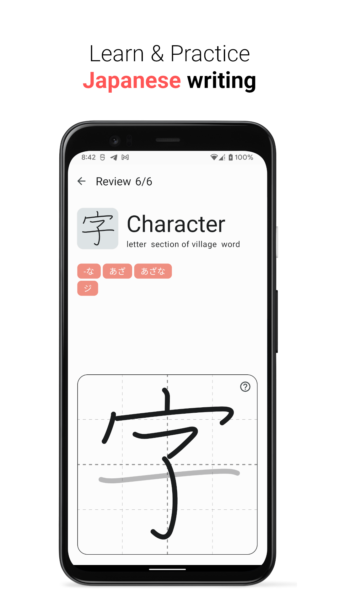
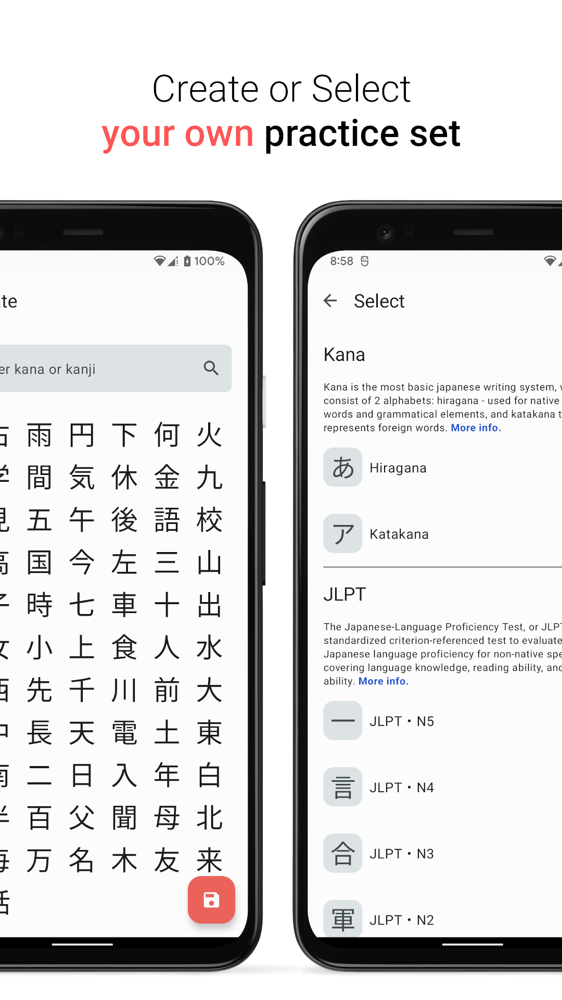
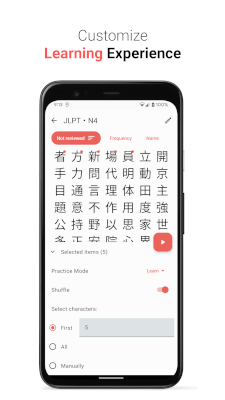
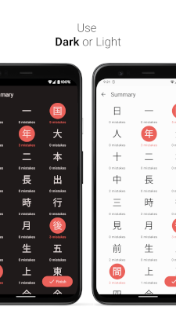

#  Kanji-Dojo

Learn & Practice writing Japanese characters

### Features
- Suitable for <b>absolute beginners</b> - can study kana, both Hiragana and Katakana
- List of kanji according to <i>JLPT level</i> are available, more are coming
- Create your own list to study, <b>more than 6000 characters</b> in total are available
- <b>Works offline</b>
- Everything is available for free, <u>source code is open</u> for everyone

<h3 style="display: inline">Screenshots</h3>

### Contributing
- Pull-Requests are welcome!
- Before making PR discuss an issue 
- Use proper code formatting

