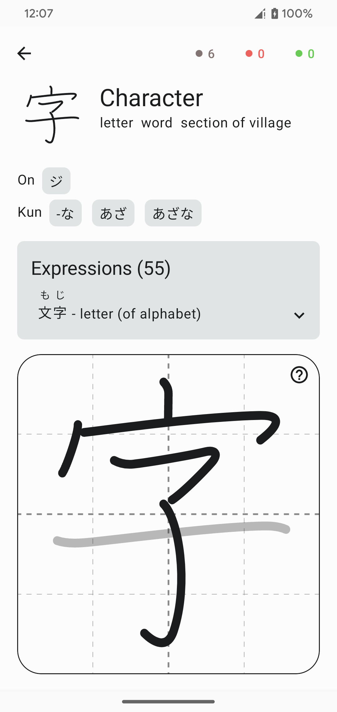
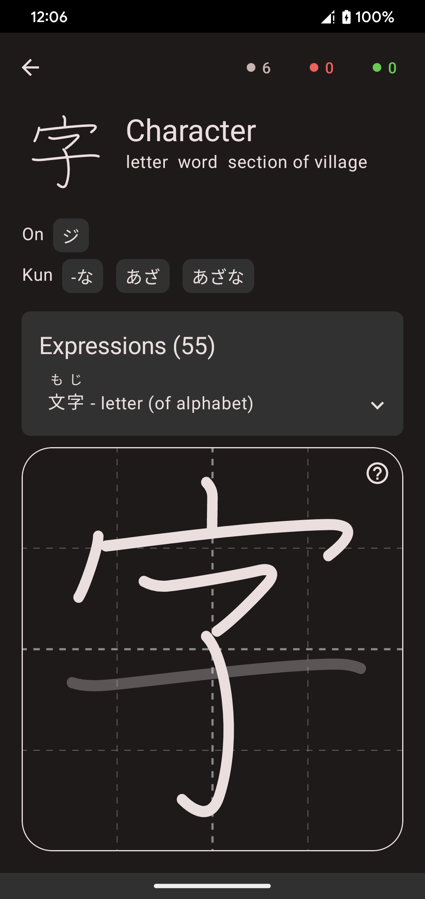
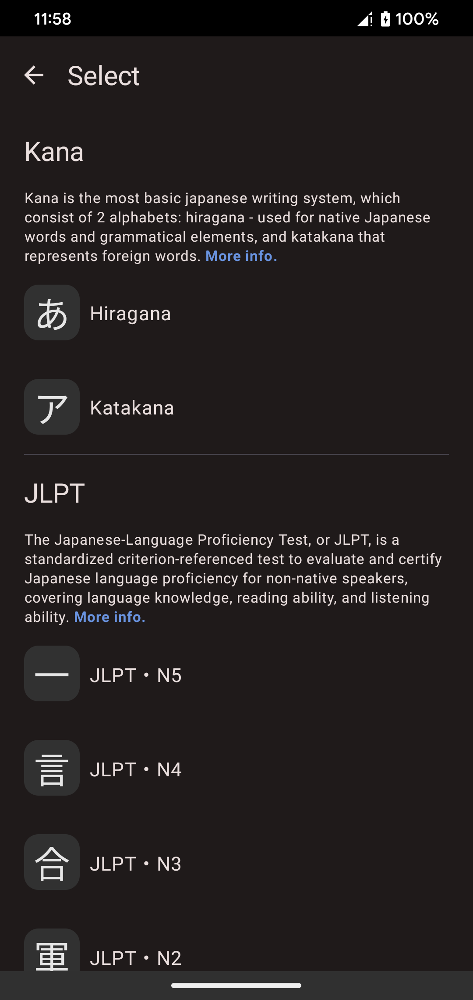
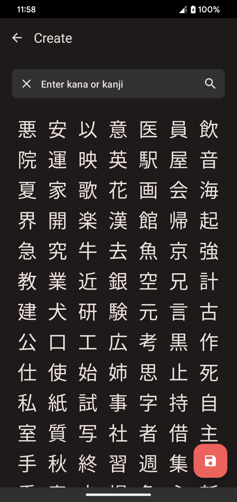
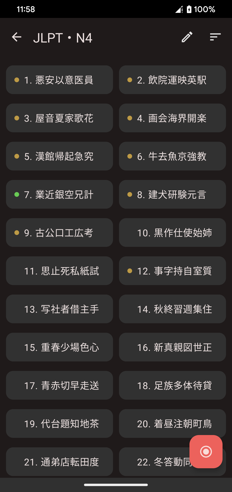
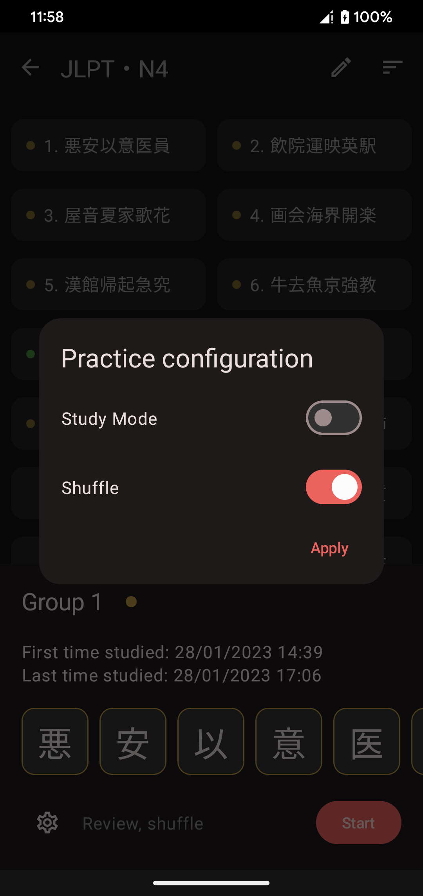
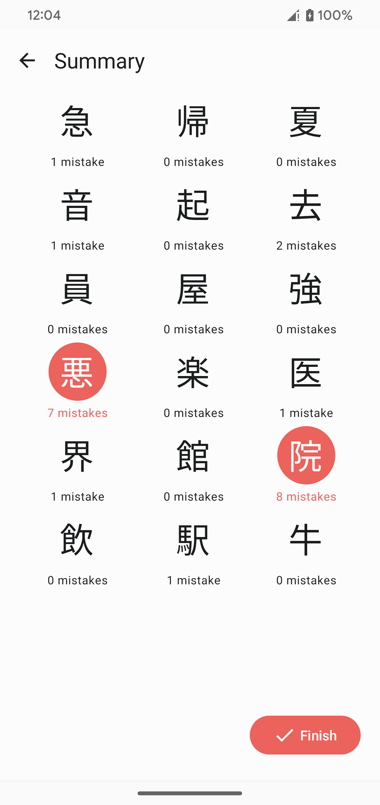
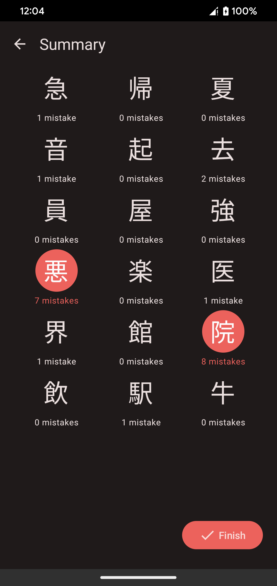

# Kanji Dojo

Learn & practice writing Japanese characters

### Features
- Study **kana** (both Hiragana and Katakana) and kanji
- Practice by following JLPT levels or school grades
- Create your own list to study, <b>more than 6000 characters</b> in total are available
- Works <b>offline</b>

There is separate repository for dictionaries parser and data here: [Kanji-Dojo-Data](https://github.com/syt0r/Kanji-Dojo-Data)

<h3 style="display: inline">Screenshots</h3>

### Downloads

Or get the latest APK from the [Releases Section](https://github.com/syt0r/Kanji-Dojo/releases/latest).

### Version comparison

| Feature   | Fdroid | Google Play                  | Desktop |
|-----------|--------|------------------------------|---------|
| Analytics | -      | Firebase, enabled by default | -       |
| Other     | -      | Play services in app review  | -       |

### Contributing
- Pull-Requests are welcome!
- Before making PR create and discuss the issue 
- Use proper code formatting

### Project details

Used libraries: `Compose Multiplatform`, `Kotlin Coroutines`, `Koin`, `SqlDelight` 

Most parts of the app are implemented in the `core` multiplatform module. The `app` module only contains some specific parts for the Fdroid and Google Play versions (flavors)

Under the main package path there are 2 different packages: 
* `core` - contains app's general logic for features like repositories, databases, app state managers and handlers
* `presentation` - contains UI, navigation logic, screen specific logic and use cases

Typically a feature under `core` package is placed in a separate package and consist of an interface and implementation. 

The `presentation` package contains common UI and screen infrastructure. A single screen contains:
* `<ScreenName>Contract` - an interface with screen's view model and screen state data
* `<ScreenName>ViewModel` - handles screen's logic
* `<ScreenName><Action>UseCase` - components that handle some specific action, invoked by view model
* `<ScreenName>Screen` composable that handles navigation and communication between UI and view model
* `<ScreenName>UI` - composable function that represents UI, it depends only on data so it can be covered by previews
* `<ScreenName>Module` - a koin module that defines how to provide all screen specific components. 
 **Note:** View models should be additionally registered in `androidViewModelModule` since on android they're additionally wrapped by a platform specific component
* (Optional) `Content` interface for screens that can be replaced in flavors, like `SettingsScreenContract.Content`

There is a single Koin's `module` for all features under `core` package, but there are also separate modules for a platform (`platformComponentsModule`) and flavor (`flavorModule`) specific features. All screens have their own koin modules

### Credits

* **KanjiVG** 
  Provides writing strokes, radicals information  
  License: Creative Commons Attribution-Share Alike 3.0 
  Link: https://kanjivg.tagaini.net/
* **Kanji Dic** 
  Provides characters info, such as meanings, readings and classifications  
  License: Creative Commons Attribution-Share Alike 3.0 
  Link: http://www.edrdg.org/wiki/index.php/KANJIDIC_Project
* **Tanos by Jonathan Waller** 
  Provides JLPT classification for kanji  
  License: Creative Commons BY 
  Link: http://www.tanos.co.uk/jlpt/
* **JMDict** 
  Japanese-Multilingual dictionary, provides expressions  
  License: Creative Commons Attribution-Share Alike 4.0 
  Link: https://www.edrdg.org/jmdict/j_jmdict.html
* **JmdictFurigana** 
  Open-source furigana resource to complement the EDICT/Jmdict and ENAMDICT/Jmnedict dictionary files  
  License: Creative Commons Attribution-Share Alike 4.0 
  Link: https://github.com/Doublevil/JmdictFurigana
* **Frequency list by Leeds university** 
  Words ranking by frequency of usage in internet  
  License: Creative Commons BY 
  Link: http://corpus.leeds.ac.uk/list.html

### License

> (c) 2022-2023 Yaroslav Shuliak
> 
> This is free software: you can redistribute it and/or modify it under the terms of the GNU General Public License as published by the Free Software Foundation, either version 3 of the License, or (at your option) any later version.
> 
> This software is distributed in the hope that it will be useful, but WITHOUT ANY WARRANTY; without even the implied warranty of MERCHANTABILITY or FITNESS FOR A PARTICULAR PURPOSE. See the GNU General Public License for more details.
> 
> You should have received a copy of the GNU General Public License along with this app. If not, see https://www.gnu.org/licenses/.
