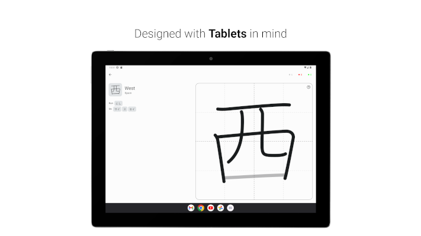

#  Kanji-Dojo

Learn & Practice writing Japanese characters

### Features
- Suitable for <b>absolute beginners</b> - can study kana, both Hiragana and Katakana
- List of kanji according to <i>JLPT level</i> are available, more are coming
- Create your own list to study, <b>more than 6000 characters</b> in total are available
- <b>Works offline</b>
- Everything is available for free, <u>source code is open</u> for everyone

<h3 style="display: inline">Screenshots</h3>

### Contributing
- Pull-Requests are welcome!
- Before making PR discuss an issue 
- Use proper code formatting

### License

> (c) 2022 Yaroslav Shuliak
> 
> This is free software: you can redistribute it and/or modify it under the terms of the GNU General Public License as published by the Free Software Foundation, either version 3 of the License, or (at your option) any later version.
> 
> This software is distributed in the hope that it will be useful, but WITHOUT ANY WARRANTY; without even the implied warranty of MERCHANTABILITY or FITNESS FOR A PARTICULAR PURPOSE. See the GNU General Public License for more details.
> 
> You should have received a copy of the GNU General Public License along with this app. If not, see https://www.gnu.org/licenses/.
