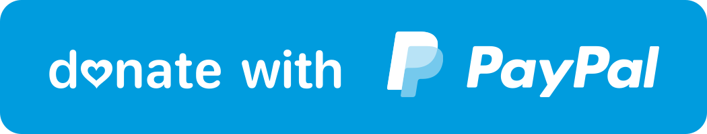

# Kanji-Dojo

Learn & practice writing Japanese characters

### Features
- Study **kana** (both Hiragana and Katakana) and kanji
- Practice by following JLPT levels or school grades
- Create your own list to study, <b>more than 6000 characters</b> in total are available
- Works <b>offline</b>

<h3 style="display: inline">Screenshots</h3>

### Downloads

### Support this project

### Contributing
- Pull-Requests are welcome!
- Before making PR create and discuss the issue 
- Use proper code formatting

### Credits

* **KanjiVG** 
  Provides writing strokes, radicals information  
  License: Creative Commons Attribution-Share Alike 3.0 
  Link: https://kanjivg.tagaini.net/
* **Kanji Dic** 
  Provides characters info, such as meanings, readings and classifications  
  License: Creative Commons Attribution-Share Alike 3.0 
  Link: http://www.edrdg.org/wiki/index.php/KANJIDIC_Project
* **Tanos by Jonathan Waller** 
  Provides JLPT classification for kanji  
  License: Creative Commons BY 
  Link: http://www.tanos.co.uk/jlpt/
* **JMDict** 
  Japanese-Multilingual dictionary, provides expressions  
  License: Creative Commons Attribution-Share Alike 4.0 
  Link: https://www.edrdg.org/jmdict/j_jmdict.html
* **JmdictFurigana** 
  Open-source furigana resource to complement the EDICT/Jmdict and ENAMDICT/Jmnedict dictionary files  
  License: Creative Commons Attribution-Share Alike 4.0 
  Link: https://github.com/Doublevil/JmdictFurigana
* **Frequency list by Leeds university** 
  Words ranking by frequency of usage in internet  
  License: Creative Commons BY 
  Link: http://corpus.leeds.ac.uk/list.html

### License

> (c) 2022 Yaroslav Shuliak
> 
> This is free software: you can redistribute it and/or modify it under the terms of the GNU General Public License as published by the Free Software Foundation, either version 3 of the License, or (at your option) any later version.
> 
> This software is distributed in the hope that it will be useful, but WITHOUT ANY WARRANTY; without even the implied warranty of MERCHANTABILITY or FITNESS FOR A PARTICULAR PURPOSE. See the GNU General Public License for more details.
> 
> You should have received a copy of the GNU General Public License along with this app. If not, see https://www.gnu.org/licenses/.
